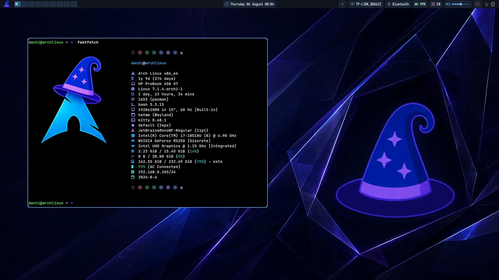
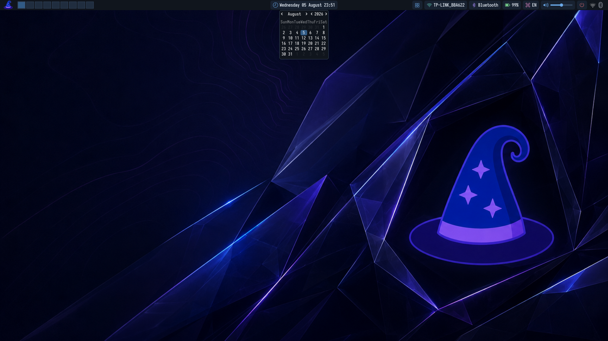

[](https://paypal.me/dachina)

# hatwm

HatWM is a small Wayland compositor/window manager written in Go on top of wlroots via `github.com/swaywm/go-wlroots`.

This is a clean-room core focused on predictable ownership and a small stable feature set:

- XDG toplevels and popups
- XWayland windows, including override-redirect popups
- pointer and keyboard input
- tiling / floating layouts
- focus cycling and fullscreen
- persistent borders with optional rounded corners (no per-frame destroy/recreate)
- autostart and `hatwmbg` wallpaper support
- automatic config creation and reload
- configurable desktop appearance, cursors, and window opacity
- session locking, idle handling, and desktop protocol integrations
- an IPC socket used by `hatwmctl`, panels, pagers, and scripts
- an in-process ScreenCast and appearance-settings portal backend

## Screenshot

| Desktop | Calendar popup |
| :---: | :---: |
| [](docs/screenshots/hatwm-desktop.png) | [](docs/screenshots/hatwm-calendar.png) |

Click the preview to view the full-resolution screenshot.

## Project layout

```text
cmd/hatwm/                  executable entry point
internal/compositor/       compositor implementation and tests
internal/compositor/protocols/
                            vendored Wayland protocol definitions
data/                       session and XDG portal integration files
meson.build                 build, test, and installation rules
```

The executable package is intentionally small. Window management, input,
rendering, IPC, XWayland, portal, and native wlroots bridge code live together
in the internal compositor package because cgo compiles the C bridge alongside
the Go package that owns its callbacks.

## Build requirements

- Go 1.26.5 or newer, as declared by `go.mod`
- Meson and Ninja
- wlroots 0.18 development files
- Wayland development files
- wayland-protocols (including the staging `xdg-dialog-v1` definition)
- pkg-config
- xkbcommon
- PipeWire and systemd development files
- XCB and XCB Shape development files

Depending on the enabled features, runtime integrations use:

- `xorg-xwayland` for X11 applications
- `hatwmbg` in `PATH` when a wallpaper is configured
- `xdg-desktop-portal` as the application-facing portal frontend
- `xdg-desktop-portal-gtk` for ordinary desktop portals and
  `xdg-desktop-portal-wlr` for the configured Screenshot portal
- `slurp` for interactive monitor selection by the ScreenCast portal
- `wpctl`, `pactl`, or `amixer` for the default volume bindings
- `gsettings` when synchronizing GTK and GNOME appearance preferences
- one notification daemon: `mako` (recommended), `swaync`, or `dunst`

## Build

```sh
meson setup build
meson compile -C build
meson test -C build
```

Meson uses Ninja as its default backend and generates Wayland protocol sources
inside the build directory. The resulting compositor is `build/hatwm`.

Nested testing from an existing Wayland session:

```sh
meson compile -C build nested
```

Install HatWM, its session entry, and portal metadata system-wide:

```sh
sudo meson install -C build
```

The Meson project defaults to `/usr`, installing `hatwm` and `hatwm-session`
in `/usr/bin` and the display-manager entry at
`/usr/share/wayland-sessions/hatwm.desktop`. Log out and select **HatWM** in
your display manager. To start the build directly from a TTY, use:

```sh
dbus-run-session ./build/hatwm
```

For package staging, run `DESTDIR="$pkgdir" meson install -C build`. Format or
vet the Go sources with `meson compile -C build fmt` and
`meson compile -C build vet`; uninstall with
`sudo ninja -C build uninstall`.

## Keyboard layouts

HatWM can compile and cycle multiple XKB layouts directly in the compositor.
The default configuration uses US English, Georgian, and Russian:

```ini
[settings]
keyboard_layouts = us,ge,ru
# keyboard_variants =
# keyboard_options =

[keybindings]
Mod4+Shift+space = toggle_keyboard_layout
```

Layout names are standard XKB layout identifiers. The action cycles in the
configured order and applies the selected group to every attached keyboard.

## Configuration

On first start HatWM creates:

```text
~/.config/hatwm/config
```

The config uses an INI-like format. Changes are reloaded automatically after
the file modification time changes.

Wallpapers are displayed by the standalone `hatwmbg` layer-shell client:

```ini
[settings]
wallpaper = ~/Pictures/Wallpapers/wallpaper.jpg
```

Install `hatwmbg` first, or otherwise ensure its executable is in HatWM's
`PATH`. HatWM starts it automatically, replaces it when the configured path
changes, and stops it during compositor shutdown. JPEG, PNG, and GIF images
are supported.

Border rounding is configurable with:

```ini
border_size = 2
border_rounding = 10
focus_follows_mouse = false
window_opacity = 0.95
```

`border_rounding = 0` keeps square corners. Rounded corners use persistent,
reusable raw wlroots scene rectangles: corner slices are allocated lazily,
then resized, repositioned, or disabled rather than destroyed and recreated
during normal commits.

`window_opacity` accepts values from `0.0` (fully transparent) to `1.0`
(fully opaque) and applies to native Wayland and XWayland application windows.
Borders, wallpaper, panels, and other layer-shell surfaces keep their own
opacity.

HatWM can coordinate the desktop appearance used by GTK, portals, cursors,
and applications launched after a reload:

```ini
[appearance]
color_scheme = dark
gtk_theme = adw-gtk3-dark
icon_theme = Reversal-dark
cursor_theme = Adwaita
cursor_size = 24
font_name = Sans 10
# qt_style = Fusion
# qt_platform_theme = qt6ct
window_button_layout = appmenu:maximize,close
```

`color_scheme` accepts `default`, `dark`, or `light`. HatWM reports that
preference through `org.freedesktop.impl.portal.Settings`, so sandboxed and
libadwaita applications can follow it, and synchronizes the corresponding GTK
settings through GSettings when available. HatWM deliberately does not export
`GTK_THEME`: that variable is a debugging override which can break GTK4 and
libadwaita applications when it names a GTK3-only theme. Cursor changes apply
live inside the compositor. GTK, icon, font, and Qt environment changes apply
to newly started applications; already-running applications decide for
themselves whether to reload them. The Qt fields are optional because Qt style
and platform-theme plugins must be installed separately. Cursor settings
remain accepted under `[settings]` for backward compatibility.

HatWM does not implement window minimization, so it omits the minimize
capability from native Wayland toplevels. `window_button_layout` provides the
equivalent GTK/XWayland fallback; its default keeps maximize and close while
removing the non-functional minimize button.

### Core settings

The main `[settings]` values and accepted ranges are:

| Setting | Values | Purpose |
| --- | --- | --- |
| `gaps` | `0`–`200` | space between tiled windows |
| `layout` | `tiling` or `floating` | initial global layout mode |
| `window_opacity` | `0.0`–`1.0` | application-window opacity |
| `border_size` | `0`–`32` | server-side border width |
| `border_rounding` | `0`–`128` | corner radius |
| `focus_follows_mouse` | `true` or `false` | focus a window when entering it |
| `move_step` | `1`–`500` | keyboard movement distance for floating windows |
| `volume_step` | `1`–`100` | multimedia-key volume increment |
| `workspaces` | `1`–`9` | numbered workspace count |
| `active_border_color` | `RRGGBB` or `RRGGBBAA` | focused border color |
| `inactive_border_color` | `RRGGBB` or `RRGGBBAA` | unfocused border color |

Invalid values are ignored and the corresponding default remains active.
Commands under `[autostart]` are shell commands; the entry name is only a
label, so it does not need to match the executable. Autostart commands run
once when the compositor starts; editing that section does not rerun them.

### Keybindings and pointer interaction

Bindings use `modifier+key = action [argument]`. Supported modifier names are
`Mod4`/`Super`/`Logo`, `Mod1`/`Alt`, `Shift`, and `Ctrl`/`Control`. Available
actions are `exec`, `close`, `workspace`, `move_to_workspace`,
`toggle_tiling`, `toggle_keyboard_layout`, `toggle_fullscreen`, `cycle_focus`,
`move_left`, `move_right`, `move_up`, `move_down`, `volume_up`, `volume_down`,
`volume_mute`, and `exit`.

- `Mod4` + left drag moves a floating window; in tiling mode, dragging across
  another tile swaps their layout positions.
- `Mod4` + right drag resizes a floating window from the nearest corner; in
  tiling mode, it adjusts the master/stack split.
- The directional move actions swap tiled neighbors or move a floating window
  by `move_step` pixels.

Regular floating windows may move partly beyond the left, right, and bottom
output edges while HatWM keeps a reachable strip visible. Their top edge stays
inside the usable output so the window cannot become unreachable behind a
panel. Dialog, modal, and fixed-size auto-floating windows are centered and
kept fully inside the usable area.

## IPC and `hatwmctl`

HatWM exposes a permission-restricted, newline-delimited JSON socket at
`$XDG_RUNTIME_DIR/hatwm/ipc.sock` and exports its path as `HATWM_SOCKET` to
autostarted applications. The separate `hatwmctl` client can inspect state,
watch events, and invoke compositor commands:

```sh
hatwmctl status
hatwmctl windows
hatwmctl workspace 2
hatwmctl move 3
hatwmctl toggle-tiling
hatwmctl toggle-keyboard-layout
hatwmctl set-wallpaper ~/Pictures/Wallpapers/wallpaper.jpg
hatwmctl reload
```

An IPC wallpaper change affects the running session but does not rewrite the
configuration file. See [IPC.md](IPC.md) for the protocol handshake, queries,
commands, events, and geometry records used by panels and pagers.

## Stability design

Each XDG toplevel or XWayland window is owned by one `View` object. HatWM
does not use wrapper addresses as map keys, does not retain pointers to
temporary wrapper copies, and does not use GC tombstone slices. Decorations
are persistent C scene rectangles attached to the view's root tree and are
resized/recolored instead of destroyed and recreated on normal commits.
Rounded-corner slice nodes follow the same ownership rule.

## XWayland

HatWM starts XWayland lazily and exports its display through `DISPLAY` before
running autostart commands. Regular X11 windows participate in HatWM's tiling,
focus, fullscreen, workspace, border, and interactive floating behavior.
Override-redirect windows such as menus and tooltips retain their client-owned
position and size.

On Arch Linux:

```sh
sudo pacman -S xorg-xwayland
```

X11 applications launched by HatWM inherit the correct `DISPLAY`. To test
from a terminal that is already running inside HatWM, launch an X11-only
client or force Electron to use X11:

```sh
discord --ozone-platform=x11
```

## Layer shell

HatWM implements `wlr-layer-shell-unstable-v1` through a small wlroots C shim.
It supports background, bottom, top, and overlay layers, anchors, margins,
exclusive zones, keyboard-interactive surfaces, and layer-shell popups. This
allows clients such as `hatwmbg` and Waybar to use their intended protocol.
Normal tiling uses the remaining usable area after exclusive layer surfaces
(such as a Waybar panel) reserve screen space.

## Wayland protocols

In addition to the core compositor, subcompositor, shared-memory, DMA-BUF,
seat, output, data-device, XDG shell, layer-shell, activation, viewporter,
XDG-output, screencopy, and session-lock globals, HatWM implements:

- `xdg-decoration-v1` server-side decoration negotiation
- `xdg-dialog-v1` dialog and modal hints, with centered floating placement
- `wp-fractional-scale-v1` preferred-scale reporting
- `wp-presentation`, `wp-content-type-v1`, `wp-tearing-control-v1`,
  `wp-alpha-modifier-v1`, and `wp-single-pixel-buffer-v1`
- `ext-idle-notify-v1` and `zwp-idle-inhibit-v1`, connected to input activity
- primary selection and `zwlr-data-control-v1`, plus validated drag-and-drop
- relative pointer, locked/confined pointer constraints, pointer gestures,
  cursor shapes, and virtual pointers
- keyboard-shortcuts inhibition for the focused requesting surface
- output management, output power management, and gamma control
- `ext-foreign-toplevel-list-v1` and XDG foreign v1/v2 parenting

Protocol globals are only advertised when HatWM supplies their compositor-side
behavior. Text-input/input-method mediation, virtual keyboards, touch/tablet
input, DRM leasing, and color-management/HDR are intentionally not advertised
yet because they require dedicated input, security, or rendering subsystems.

## Screen sharing portal

HatWM implements `org.freedesktop.impl.portal.ScreenCast` and
`org.freedesktop.impl.portal.Settings` as an in-process XDG Desktop Portal
backend. It advertises monitor capture with either a hidden or embedded cursor.
`SelectSources` validates the requested source and cursor modes; `Start` opens
`slurp` so the user explicitly chooses a monitor, then returns a PipeWire
video-source node containing compositor-rendered BGRx frames.

After installing, restart HatWM and `xdg-desktop-portal`. The supplied
`hatwm-portals.conf` selects HatWM for ScreenCast and appearance settings,
`wlr` for Screenshot, and GTK for the remaining desktop portals.

## Layer-shell lifecycle note

Layer-shell surfaces are configured before map. This is required because
clients such as Waybar and `hatwmbg` wait for the compositor's initial
configure before attaching their first buffer and mapping.

## Session lock

HatWM implements the modern `ext-session-lock-v1` protocol used by
`swaylock`. Lock surfaces are placed above every compositor layer and receive
exclusive keyboard and pointer input. If the lock client crashes, HatWM keeps
an opaque lock screen active instead of exposing the desktop; starting
`swaylock` again allows the session to recover.

## Window animations

HatWM animates window opening and layout-position changes on the compositor
main loop. The animation system never mutates wlroots objects from goroutines
and does not issue repeated client resize configures during animation.

```ini
[settings]
animations = true
animation_duration_ms = 180
animation_easing = ease_out_cubic
animation_open_offset = 24
```

Supported easing values are `linear`, `ease_out_quad`, `ease_out_cubic`, and
`ease_in_out_cubic`. Set `animations = false` or `animation_duration_ms = 0`
to disable transitions.

Current animations cover window opening and compositor-driven position/layout
changes. Interactive mouse move/resize remains immediate for precise pointer
tracking. Close animations are intentionally not faked after a client unmaps;
a safe close animation requires retaining a rendered snapshot.

## Notifications

HatWM can start a desktop notification daemon automatically. The compositor
exposes the layer-shell support used to render notification popups, while the
daemon owns the `org.freedesktop.Notifications` D-Bus service.

```ini
[settings]
notifications = true
notification_daemon = auto
```

`auto` checks for `mako`, then `swaync`, then `dunst`. A custom command is also
accepted:

```ini
notification_daemon = mako --config ~/.config/mako/config
```

Set `notifications = false` or `notification_daemon = none` to disable
automatic startup. Test notifications with:

```sh
notify-send "HatWM" "Notifications are working"
```

HatWM must run inside a D-Bus user session. Display managers normally provide
one. When starting an installed build from a TTY, use
`dbus-run-session hatwm` (or wrap your normal startup command).

## Volume keys

HatWM binds standard keyboard multimedia keys by default:

```ini
[settings]
volume_step = 5

[keybindings]
XF86AudioRaiseVolume = volume_up
XF86AudioLowerVolume = volume_down
XF86AudioMute = volume_mute
```

The compositor automatically uses the first available audio controller in
this order: `wpctl` (PipeWire), `pactl` (PulseAudio/PipeWire Pulse), then
`amixer` (ALSA). On Arch Linux with PipeWire, `wpctl` is provided by the
`wireplumber` package.

## Workspaces

HatWM provides 9 numbered workspaces by default. Configure the number (1-9) in
`~/.config/hatwm/config`:

```ini
[settings]
workspaces = 9
```

Default bindings:

```ini
Mod4+1 = workspace 1
Mod4+Shift+1 = move_to_workspace 1
```

The same pattern applies through workspace 9. Moving a window does not
implicitly switch workspaces.
